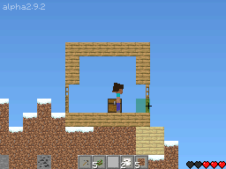
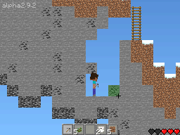
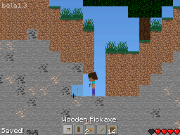

# ds-craft

DS-Craft is a Minecraft clone for Nintendo DS, written in C and C++.

It has only been tested with MelonDS and DraStic.

## Dependencies

- devkitPro for Nintendo DS (NDS) development ([how to install](https://devkitpro.org/wiki/Getting_Started))
- Python 3

## Building and running

### With command line

If you just want to compile, use `make`. To make and then run, use `make build run` (but you need to modify the emulator in the makefile). To recompile, use `make clean build` and if you want to recompile and run use `make clean build run`.

### Using Code::Blocks (on Linux)

To build, press the Build button on the top of the window. To run, press the Run button on the top of the window. To build and run, press the Build and Run button on the top of the window. To recompile, press the Rebuild button on top of the window.

Note that Code::Blocks support is only supported on Linux.

## Screenshots

## Credits

Mojang - textures, font and sounds

The libnds example authors

[This tutorial](https://www.youtube.com/watch?v=yb6QJl6mqf4)

