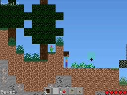

# ds-craft

DS-Craft is a Minecraft demake for Nintendo DS written in C and C++ inspired by [Paper Minecraft](https://scratch.mit.edu/projects/10128407/).

[](https://www.codefactor.io/repository/github/iammoltony/ds-craft/overview/main)


## Cloning

Since `ds-craft` uses submodules, you should clone it like this:

```bash
git clone https://github.com/IAmMoltony/ds-craft --recurse-submodules
```

Or if you already cloned it without `--recurse-submodules`, then you need to run this in the repo folder:

```bash
git submodule update --init --recursive
```

## Dependencies

- devkitPro for Nintendo DS (NDS) development. ([How to install](https://devkitpro.org/wiki/Getting_Started)).
- Python 3 (For generating `images.h` which is required for building)

## Building and running

### With command line (everywhere)

The Makefile has these targets for building and running:

- `build` - build the game. This is the default target, so running `make` is the same as `make build`.

- `run` - run the game in the emulator specified. The emulator has to be specified as `EMULATOR=/path/to/emulator` at the end of the command. If you're on Windows, then the slashes in the path must be forward-slashes (`/`) instead of backslashes (`\`).

- `clean` - remove all binaries.

### Using Code::Blocks (on Linux)

To build, press the Build button on the top of the window. To run, press the Run button on the top of the window. To build and run, press the Build and Run
button on the top of the window. To rebuild, press the Rebuild button on top of the window.

If you want to run from Code::Blocks, set the emulator in the `codeblocks_run` file.

### Using Visual Studio (on Windows)

You can use Visual Studio the same way as you do with other projects. Just ignore the libnds and devkitARM error messages.

If you want to run the game from Visual Studio:

1. go to the `ds-craft` project's properties ('ds-craft'->Properties)
1. click on Debugging
1. make sure the configuration is set to 'All Configurations'
1. change 'Command' to your Nintendo DS emulator path

## Docs

To generate documentation, you need [Doxygen](https://doxygen.nl). If you need PDF file output as well, then install [EPS to PDF](https://tug.org/epstopdf/). Once you're ready, pull up your terminal, go to the root of the project and run `doxygen`. You can use Doxywizard too, if you like.

## Screenshots




*Game version on screenshots is **beta1.3**.*

## Credits

Mojang - textures, font and sounds

libNDS examples - a lot of lower-level code

[This tutorial](https://www.youtube.com/watch?v=yb6QJl6mqf4) - logo creation
