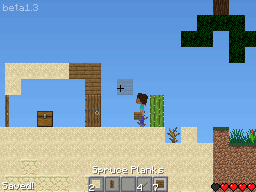

# ds-craft

DS-Craft is a Minecraft clone for Nintendo DS, writeen in C and C++.

## Controls

Press left and right on the D-Pad to move horizontally, press D-Pad up to jump, the Select button to open your inventory, the A button to place block, and the B to destroy block. To select an item from the hotbar, press the R button.

### Touch to move

If touch-to-move is enabled in the settings, you can ose the bottom screen to move around. For horizontal movement,touch the bottom screen on either side. To jump, touch the top of the bottom screen.

If touch the move is set to "right-handed" then the D-Pad and ABXY buttons are swapped (except in inventory and menus), so down on the D-Pad becomes the B button, etc.

You can still use the d-pad, even if touch to move is enabled.

### Inventory manipulation

The A button selects an inventory slot. Pressing A again will either stack the items or move them. To select next hotbar slot press the R button.

### Crafting

Press the R button to select the next crafting recipe. Press the A button to craft the item, if you have enough items for that.

## Dependencies

- devkitPro for Nintendo DS (NDS) development ([how to install](https://devkitpro.org/wiki/Getting_Started))
- Python 3

## Building and running

### With command line

If you just want to compile, use `make`. To make and then run, use `make build run` (but you need to modify the emulator in the makefile). To recompile, use `make clean build` and if you want to recompile and run use `make clean build run`.

### Using Code::Blocks (on Linux)

To build, press the Build button on the top of the window. To run, press the Run button on the top of the window. To build and run, press the Build and Run button on the top of the window. To recompile, press the Rebuild button on top of the window.

Note that Code::Blocks support is only supported on Linux.

## Screenshots

## Credits

Mojang - textures, font and sounds

The libnds example authors

[This tutorial](https://www.youtube.com/watch?v=yb6QJl6mqf4)
